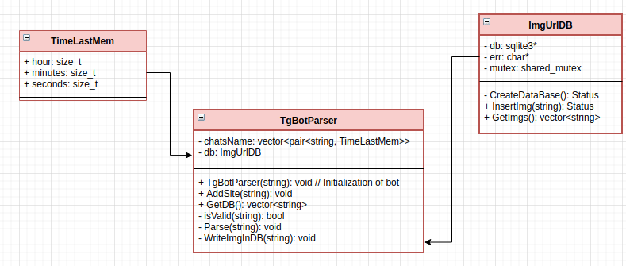

# Поисковик мемов "Memento"

## В проекте учавствуют:
* [Кидинова Дарья](https://github.com/ezuryy) 
* [Частиков Александр](https://github.com/papazloynt)
* [Бахланов Даниил](https://github.com/Similization)
* [Ушаков Захар](https://github.com/HvarZ)

## Основная задача проекта
Проет предствляет из себя сайт для помощи в нахождении шаблонов и не только 
шаблонов давно забытых или наоборот незабытых мемов. 

## Принцип работы

