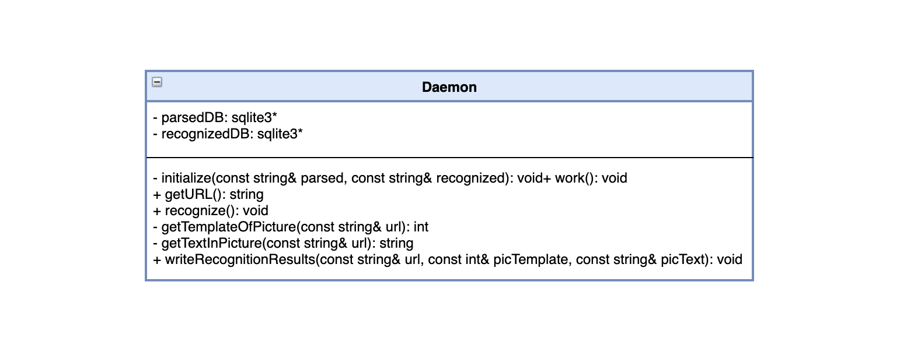

# Поисковик мемов "Memento"

## В проекте учавствуют:
* [Кидинова Дарья](https://github.com/ezuryy) 
* [Частиков Александр](https://github.com/papazloynt)
* [Бахланов Даниил](https://github.com/Similization)
* [Ушаков Захар](https://github.com/HvarZ)

## Основная задача проекта
Бывает, что захотелось скинуть другу мем, который видел пару дней назад, но не помнишь где и не можешь его найти? В такие моменты можно воспользоваться нашей системой!

Наша работа состоит том, чтобы запарсить мемы из телеграмм каналов или несколько групп ВКонтакте, создать базу из картинок. Потом кластеризовать мемы по нескольким шаблонам, а потом распознать текст на картинках.
Пользователь сайта сначала выбирает шаблон мема, ему представляются все мемы с этим шаблоном, потом уже ищет по содержанию мема (подстроке), и тут помогает наш распознанный текст.

## Принцип работы

## Распределение задач

### Кидинова Дарья

Создать демона, который мониторит, появились ли новые картинки для распознавания в одной БД `parsedDB`, и если появились, 
определять к какому шаблону принадлежит картинка, распознавать на ней текст и записывать в другую БД `recognizedDB`. 
При этом функцию для распознавания текста пишу я, а для функцию для определения шаблона напишет Захар.
Для распознавания текста собираюсь использовать `tesseract`. На UML диаграмме класс `Daemon`, взаимодействующий с двумя БД.   

